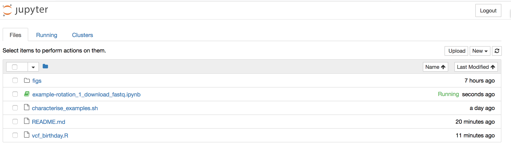

# How to keep a lab notebook when you don't have a lab

## index

### Text editors

- [VScode](###VScode)
- [Sublime text](###Sublime_text)

### Languages for note taking

- [Jupyter notebook](###Jupyter_notebook)

### VSCode

What is it: A text editor with built in Git capabilities

What can it be used for:

- Logging day to day coding
- Writing code
- Committing code

#### Download

Link [here](https://code.visualstudio.com/download)

#### Some examples

Markdown, with preview on the right panel.


Viewing changes in git


### Sublime_text

What is it: A text editor, I'm pretty sure that's it. It's like notepad. There are indeed plugins, but honestly. It's not as smooth as vscode.

#### Download it

Link [here](https://www.sublimetext.com/3)

#### Sublimey example

Folder view on the left, minimap on the right.


### Jupyter_notebook

What is it: It looks like a text editor, but it's actually a way to compile code, you can view plots as you write code. Neat stuff.

#### How to launch

This one is a bit of a time. You need to install it first, then you can launch it from the command line with:

``` bash
jupyter notebook <filename>
```

which will initiate a notebook session in the same directory.



You can then click create, or open a notebook you already have, and begin editing.

Here is a change
